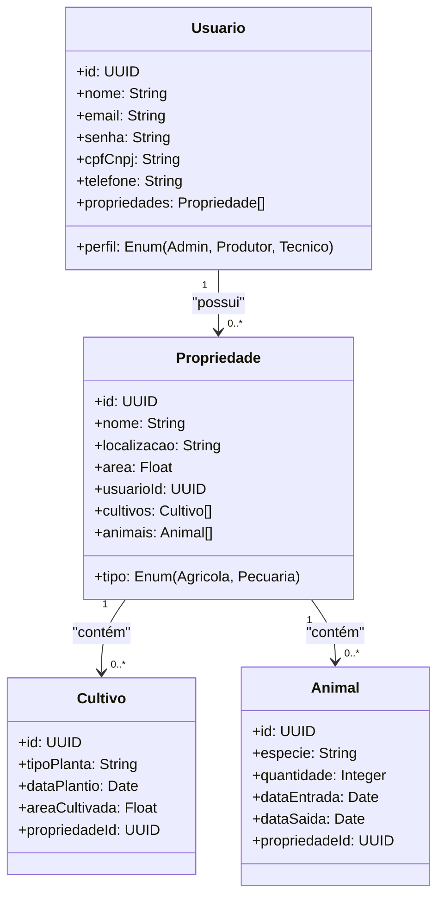
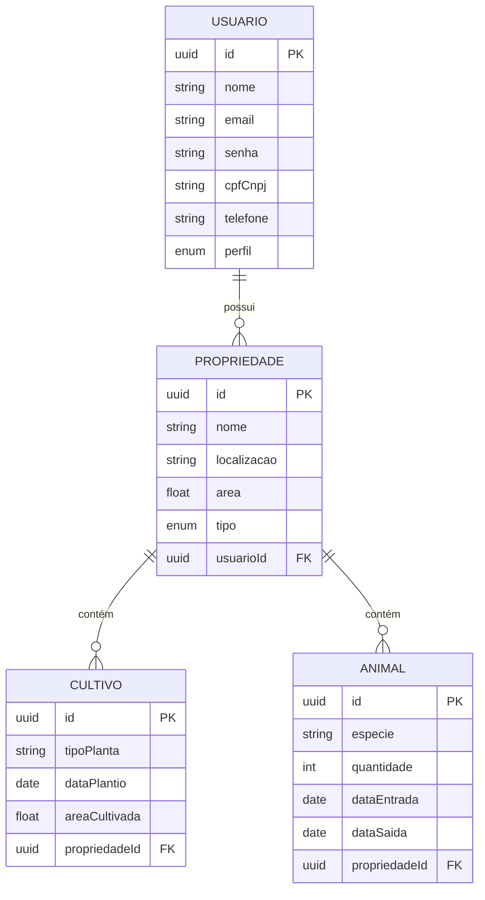

# CultivaTech

Levantamento de Requisitos para Sistema de Gestão de Propriedades Rurais Baseado em Microserviços.

1. Visão Geral

**O sistema será composto por microserviços que permitirão:**

Cadastro e autenticação de usuários (com segurança robusta).

Gestão de propriedades rurais (cadastro, edição, exclusão).

Registro de cultivares de plantas e criação de animais.

Geração de insights para melhor gestão das propriedades.

2. Requisitos Funcionais

2.1. Módulo de Autenticação e Usuários

RF01: Cadastro de usuário (nome, e-mail, senha, CPF/CNPJ, telefone).

RF02: Login com autenticação JWT/OAuth2.

RF03: Recuperação de senha via e-mail/SMS.

RF04: Perfis de acesso (Admin, Produtor, Técnico Agrícola).

2.2. Módulo de Propriedades Rurais

RF05: Cadastro de propriedades (nome, localização, área, tipo - agrícola/pecuária).

RF06: Associação de múltiplas propriedades a um usuário.

RF07: Edição e exclusão de propriedades.

2.3. Módulo de Cultivos e Criação Animal

RF08: Cadastro de cultivares (tipo de planta, data de plantio, área cultivada).

RF09: Cadastro de animais (espécie, quantidade, data de entrada/saída).

RF10: Acompanhamento de safras e ciclos produtivos.

2.4. Módulo de Análise e Insights

RF11: Dashboard com métricas (produtividade, custos, previsão climática).

RF12: Relatórios personalizados (exportação em PDF/Excel).

RF13: Alertas (pragas, vacinação, irrigação).

3. Requisitos Não Funcionais

RNF01: Escalabilidade (arquitetura de microserviços).

RNF02: Segurança (HTTPS, JWT, criptografia de senhas).

RNF03: Banco de dados relacional (PostgreSQL) + Cache (Redis).

RNF04: Disponibilidade (deploy em cloud AWS/Azure).

RNF05: Logs e monitoramento (ELK Stack/Prometheus).

4. Diagrama de Classes

5. Modelo do Banco de Dados

6. Arquitetura de Microserviços

Serviço de Autenticação (Spring Security/Keycloak).

Serviço de Usuários (CRUD de usuários).

Serviço de Propriedades (Gestão de fazendas).

Serviço de Cultivos/Animais (Registro de produção).

Serviço de Analytics (Geração de insights).

API Gateway (Spring Cloud Gateway).

Service Discovery (Eureka).

7. Próximos Passos

Definir tecnologias específicas (Spring Boot, Node.js, Django?).

Detalhar contratos de API (Swagger/OpenAPI).

Implementar autenticação JWT + OAuth2.

Configurar CI/CD (GitHub Actions/GitLab CI).

# Checklist de Implementação

## 🔐 Autenticação e Usuários

- [x] RF01 - Cadastro de usuário
- [ ] RF02 - Login (JWT/OAuth2)
- [ ] RF03 - Recuperação de senha
- [ ] RF04 - Perfis de acesso

## 🌱 Propriedades Rurais

- [ ] RF05 - Cadastro de propriedades
- [ ] RF06 - Múltiplas propriedades por usuário
- [ ] RF07 - Edição/exclusão de propriedades

## 🐄 Cultivos e Animais

- [ ] RF08 - Cadastro de cultivares
- [ ] RF09 - Cadastro de animais
- [ ] RF10 - Acompanhamento de safras

## 📊 Análise e Insights

- [ ] RF11 - Dashboard de métricas
- [ ] RF12 - Relatórios exportáveis
- [ ] RF13 - Sistema de alertas

## ⚙️ Infraestrutura

- [x ] RNF01 - Microserviços
- [x ] RNF02 - Segurança
- [x ] RNF03 - Banco de dados
- [x] RNF04 - Cloud deploy
- [ ] RNF05 - Monitoramento

<!-- 
✅ Arquivo docker-compose.yml:
docker-compose.yml orquestra 6 containers principais dentro de uma rede chamada cultivatech-net:

discovery-server (Spring Eureka)
config-server (Spring Cloud Config)
api-gateway (Spring Cloud Gateway)
auth-service (Node.js - autenticação de usuários)
auth-db (MySQL - banco para o auth-service)
auth-frontend (React - interface do usuário)

🔧 Explicação dos serviços do seu projeto CultivaTech:
🧠 discovery-server
Função: Servidor Eureka do Spring Cloud, responsável por registrar e descobrir microserviços.
Porta: 8761 (externa 8762)
Healthcheck: Verifica se está saudável pela URL /actuator/health.

⚙️ config-server
Função: Fornece arquivos de configuração centralizados para os serviços Spring.
Depende de: discovery-server (só inicia quando ele estiver saudável).
Healthcheck: também consulta /config/actuator/health.

🌐 api-gateway
Função: Gateway central que recebe requisições externas e redireciona para os serviços corretos.
Porta: 8080 (acesso do sistema)
Depende de: discovery-server

🔐 auth-service (Node.js)
Função: Serviço de autenticação e gerenciamento de usuários.
Porta: 3000
Variáveis:
 - DB_HOST, DB_USER, DB_PASSWORD: conexão com o banco MySQL
 - JWT_SECRET: chave para autenticação via JWT
 - EUREKA_URL: registra-se no Eureka
Depende de: discovery-server e auth-db

💾 auth-db (MySQL)
Função: Banco de dados do serviço de autenticação
Volume:
 - Persistência dos dados (db-data)
 - Script SQL de inicialização (dump.sql)
 - Portas 3306
Healthcheck: Verifica se o MySQL está pronto

💻 auth-frontend (React)
Função: Interface web do sistema de login/autenticação
Porta: 5173
Depende de: api-gateway

🌐 Rede e Volumes
Rede: cultivatech-net conecta todos os serviços.
Volume: db-data para manter os dados do banco mesmo após reinicializações.

docker-compose down -v  # Remove tudo, incluindo volumes
docker-compose up -d    # Recria todos os serviços# CultivaTech - CI/CD Ativo
